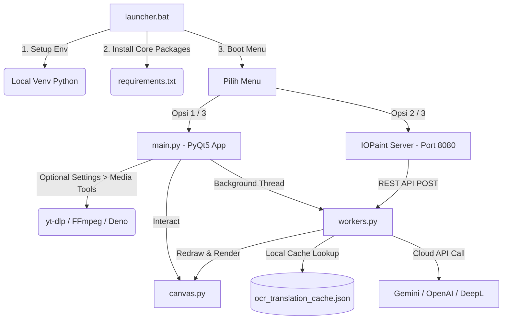

# MangaTranslate 🎨🤖

MangaTranslate adalah aplikasi desktop premium berskala enterprise untuk menerjemahkan dan melakukan typesetting manga secara interaktif menggunakan Python 3 dan PyQt5. Aplikasi ini dirancang khusus untuk memodernisasi workflow scanlation secara profesional dengan menggabungkan deteksi bubble otomatis berbasis Deep Learning, multi-engine OCR, penerjemah kecerdasan buatan (AI) terintegrasi, workspace berbasis layer ala Photoshop, sistem undo/redo visual berbasis timeline, serta media center terintegrasi.

---

## 🛠️ Arsitektur & Alur Kerja Sistem (System Workflows)

MangaTranslate dirancang dengan pendekatan arsitektur modular yang memisahkan antara GUI thread (PyQt5), Thread Worker untuk proses komputasi berat offline/online (OCR, inpainting, terjemahan API), dan subsistem inpainting eksternal.



### 1. Bootloader & Zero-Configuration Environment (`launcher.bat`)
Pengguna tidak perlu melakukan instalasi dependensi inti secara manual saat virtual environment belum tersedia. File [launcher.bat](file:///e:/Project/MangaTranslate/launcher.bat) bertindak sebagai bootstrapper otomatis dengan langkah-langkah berikut:
* **Deteksi Python & Virtual Environment**: Memastikan Python terpasang di system PATH, lalu membuat folder `venv` jika belum ada.
* **Auto-upgrade & Dependency Installation**: Meng-upgrade `pip` secara otomatis, kemudian memasang dependensi dari [requirements.txt](file:///e:/Project/MangaTranslate/requirements.txt).
* **Media Tools Opsional**: Dependensi YouTube/Media (`yt-dlp`, `yt-dlp-ejs`, FFmpeg, dan Deno) tidak dipasang saat startup. Jika dibutuhkan, pasang dari **Settings > Media Tools** di dalam aplikasi.
* **Parallel Process Launching**: Menyediakan menu interaktif untuk meluncurkan GUI aplikasi utama, server inpainting mandiri, atau menjalankan keduanya secara paralel.

### 2. Integrasi Server Inpainting (IOPaint - LaMa)
Untuk memastikan penghapusan teks manga (clean-up) berjalan secara mulus dan presisi tanpa merusak visual latar belakang, MangaTranslate mengintegrasikan server inpainting terpisah:
* **Engine & Model**: Menggunakan **IOPaint** dengan model neural network **LaMa (big-lama)** (~196MB) yang diunduh otomatis pada eksekusi pertama.
* **Stabilitas Eksekusi**: Dikonfigurasi dalam mode CPU (dioptimalkan untuk Windows tanpa ROCm) untuk memberikan kestabilan 100% dengan waktu respon ultra-cepat (< 300ms per crop).
* **Komunikasi Restful**: Aplikasi utama berkomunikasi dengan server inpainting (`http://127.0.0.1:8080`) menggunakan Rest API `POST /api/v1/inpaint` dengan body JSON base64 untuk gambar asli dan masking area teks hitam-putih.

### 3. Antarmuka Awal & Recent Projects (Welcome Screen)
Untuk meningkatkan pengalaman pengguna baru, aplikasi mengimplementasikan layar pembuka interaktif:
* **Welcome Screen Otomatis**: Ditampilkan secara otomatis saat aplikasi dijalankan jika tidak ada folder/proyek yang sedang aktif. Layar ini didesain menggunakan gaya visual gelap (dark theme) premium.
* **Smart UI Hiding**: Saat Welcome Screen aktif, semua sidebar panel, panel kontrol status navigasi bawah, dan tombol kontrol canvas disembunyikan agar tampilan menjadi fokus dan minimalis.
* **Recent Projects Card Grid**: Menampilkan daftar proyek yang terakhir diakses dalam bentuk grid kartu interaktif. Pengguna dapat langsung membuka proyek dengan mengklik kartu tersebut, atau menghapus entri dari riwayat dengan mengklik tombol `✕` di pojok kanan kartu.
* **Quick Actions**: Tombol akses cepat untuk langsung membuka folder manga, memuat file proyek `.manga_proj`, atau membuka dokumen PDF.
* **Keyboard Shortcut Guide**: Daftar panduan pintasan tombol keyboard utama yang ditampilkan di welcome screen.

---

## 🔄 Pipeline OCR & Terjemahan (OCR & Translation Pipelines)

MangaTranslate menawarkan dua pipeline pemrosesan teks utama yang ditangani oleh [QueueProcessorWorker](file:///e:/Project/MangaTranslate/src/core/workers.py) dalam background thread agar antarmuka PyQt5 tetap responsif.

### 1. Pipeline Standar (Standard Pipeline)
Mekanisme sekuensial yang berfokus pada kecepatan pemrosesan:
1. **Seleksi Koordinat (Crop)**: Pengguna membuat seleksi kotak (rect) atau lingkaran (oval) pada kanvas.
2. **Preprocessing Citra**: Gambar dipotong, lalu jika terdeteksi bahasa Inggris atau menggunakan engine non-Manga-OCR, citra akan diubah tingkat kontrasnya dan dilakukan thresholding adaptif.
3. **Eksekusi OCR**: Menggunakan engine yang dipilih (misal: Manga-OCR untuk Jepang, Tesseract untuk Inggris, dll.). Khusus engine bertenaga AI (AI OCR), citra mentah langsung dikirim tanpa preprocessing.
4. **Pembersihan Teks (Cleanup)**: Teks mentah dibersihkan dari karakter sampah dan digabung menjadi baris teks tunggal.
5. **Terjemahan API**: Mengirimkan teks ke translator pilihan (DeepL atau model AI seperti Gemini/OpenAI).
6. **Filter Safe Mode**: Menyaring kata-kata dewasa secara otomatis sebelum ditampilkan.
7. **Penyimpanan Cache & Typeset**: Menyimpan hasil OCR & terjemahan ke cache lokal, lalu merender teks baru ke kanvas typesetting.

### 2. Pipeline yang Ditingkatkan (Enhanced Pipeline)
Workflow mutakhir untuk akurasi terbaik pada teks manga berbahasa Jepang:
* **Konsensus Multi-Engine**: Aplikasi memproses potongan gambar menggunakan **Manga-OCR** (offline), sekaligus memproses citra yang telah melalui thresholding menggunakan **Tesseract** (offline).
* **Koreksi & Sintesis AI**: Kedua teks hasil pembacaan OCR tersebut dikirimkan ke model AI secara bersamaan.
* **Prompt Engineering Khusus**: AI diinstruksikan untuk mendeteksi bahasa, memperbaiki kesalahan ketik OCR secara cerdas, menggabungkan informasi dari kedua engine, dan menerjemahkannya ke bahasa target dengan gaya percakapan alami.

### 3. Engine OCR yang Didukung
* **Manga-OCR**: Arsitektur Deep Learning lokal yang dikhususkan untuk teks manga Jepang (vertikal & horizontal).
* **Tesseract OCR**: Solusi offline legasi yang efisien untuk bahasa Inggris/lainnya.
* **EasyOCR & PaddleOCR**: Engine berbasis deep learning offline yang mendukung puluhan bahasa asing.
* **DocTR & RapidOCR**: Integrasi engine modern bertenaga ONNX runtime.
* **AI OCR (MOFRL-GPT)**: Pembacaan visual teks berbasis visi komputer langsung menggunakan model AI cloud.

### 4. Backend Translator & Preset Gaya Bahasa
Terintegrasi langsung ke berbagai provider AI papan atas dunia:
* **Provider**: OpenAI (GPT-4o, GPT-5 Mini), Google Gemini (Gemini 2.5 Flash, Gemini 2.5 Pro), DeepL API, dan OpenRouter (akses ke Claude, Llama, DeepSeek, Qwen).
* **Default Style Presets**: Mengonfigurasi gaya terjemahan secara global:
  * **Santai (Default)**: Menggunakan frasa kasual sehari-hari, tidak kaku, cocok untuk dialog manga umum.
  * **Formal**: Bahasa sopan/hormat untuk percakapan ke atasan, tetua, atau guru.
  * **Akrab**: Gaya intim untuk sahabat, teman dekat, atau pacar.
  * **Vulgar/Dewasa**: Penerjemahan eksplisit secara langsung untuk adegan dewasa tanpa sensor bahasa.
  * **Sesuai Konteks**: AI menganalisis suasana adegan manga secara kontekstual.

---

## 🤖 Pendeteksian Berbasis Deep Learning (Speech Bubble & Text Detection)

Aplikasi ini mengemas fungsionalitas otomatisasi tingkat lanjut menggunakan [AutoDetectorWorker](file:///e:/Project/MangaTranslate/src/core/workers.py) untuk memindai manga dalam jumlah besar secara cepat:

* **Bubble Detection (Deteksi Gelembung Dialog)**:
  * Memanfaatkan model pembelajaran mendalam **YOLO** (`ogkalu_pt` via model *Comic Speech Bubble Detector* atau `kitsumed_pt`) serta format **ONNX** (`kitsumed_onnx`).
  * Worker memproses gambar, menghasilkan masker biner area deteksi, menemukan kontur luar, dan mengubahnya menjadi objek `QPolygon` pada kanvas typesetting sebagai area penempatan teks siap pakai.
* **Text Detection (Deteksi Lokasi Teks)**:
  * Memindai seluruh halaman manga menggunakan detektor teks berbasis OCR untuk menemukan koordinat kotak teks secara otomatis.
* **Mekanisme Konfirmasi Interaktif**:
  * Hasil deteksi otomatis tidak langsung menimpa gambar. Area terdeteksi akan berkedip dalam warna kuning/biru/hijau pada kanvas typesetting.
  * **Right-Click** pada area terpilih untuk mengonfirmasi teks, **Middle-Click** untuk membatalkannya, atau klik ikon **Trash** overlay untuk menghapusnya.

---

## 🎨 Typesetting Interaktif & Manajemen Layer (Photoshop-style Canvas)

Kanvas penyuntingan di dalam [canvas.py](file:///e:/Project/MangaTranslate/src/ui/canvas.py) mengimplementasikan workspace bergaya editor grafis profesional:

### 1. Photoshop & Canva-Style Layers Panel
Setiap kotak dialog manga yang terjemahannya dibuat akan dikelola sebagai layer tersendiri:
* **Visual Rendering Order (Z-Index)**: Atur urutan tumpang tindih layer teks menggunakan tombol *Bring to Front* dan *Send to Back* atau melakukan drag-and-drop urutan item pada Layers Panel.
* **Visibilitas (Show/Hide)**: Toggle ikon mata (checkbox) untuk menyembunyikan layer. Layer yang disembunyikan tidak dapat diklik atau diseleksi, mencegah salah sunting.
* **Opacity Slider**: Mengatur transparansi layer dari 0% hingga 100% secara real-time.
* **Layer Renaming**: Ubah nama label layer dengan double-click pada list item di panel.
* **Layer Locking**: Mengunci koordinat dan isi layer untuk mencegah pergeseran atau penghapusan yang tidak disengaja.
* **Bi-Directional Sync**: Menyeleksi teks pada kanvas otomatis menyorot layernya di panel samping, dan sebaliknya.

### 2. Navigasi & Manipulasi Kanvas
* **Panning**: Tahan tombol klik tengah mouse (Middle Mouse Click) atau spasi untuk menggeser gambar secara bebas.
* **Zooming**: Tekan `Ctrl + Scroll Mouse` untuk memperbesar/memperkecil visual kanvas.
* **Interactive Toolbars (Pencil & Trash Overlay)**: Saat kursor diarahkan ke atas suatu teks di kanvas, ikon aksi pensil (sunting cepat) dan tempat sampah (hapus area) akan muncul secara dinamis.
* **Double-click Edit**: Melakukan double-click pada area dialog di kanvas akan membuka kotak editor teks inline secara instan.
* **Transform Mode (Hand)**: Mengaktifkan kendali rotasi dan penskalaan langsung pada kotak teks terpilih.
* **Typeset Style Settings**: Mengonfigurasi properti teks secara menyeluruh melalui panel tab Typeset:
  * Jenis Font (dilengkapi delegasi pratinjau visual), Ukuran Font, dan Warna.
  * Efek Outline: coretan garis tepi teks (stroke) dengan kontrol ketebalan, warna, dan style.
  * Alignment teks, tinggi baris (line height), dan jarak antar karakter (letter spacing).

---

## ↩️ Undo/Redo Visual Timeline (Baru di v14.9.0)

MangaTranslate kini menghadirkan sistem **Undo/Redo berbasis snapshot** yang dilengkapi tampilan timeline visual interaktif di panel kanan, memberikan kendali penuh atas sejarah penyuntingan Anda:

* **Visual Timeline "🕐 History"**: Widget `QListWidget` di bagian bawah panel kanan menampilkan seluruh riwayat aksi dengan color-coding:
  * **▶** (biru terang) — State aktif saat ini
  * **·** (abu) — Aksi masa lalu yang sudah di-undo
  * **◁** (dim) — Aksi yang bisa di-redo
* **Jump ke State Mana Pun**: Klik langsung item mana saja di timeline untuk melompat ke snapshot tersebut tanpa harus menekan Ctrl+Z berulang kali.
* **Snapshot Otomatis**: Snapshot dibuat secara otomatis setiap kali terjadi perubahan penting: menambah layer baru, menghapus area, menerjemahkan teks, menerapkan teks dari recent list, atau menghapus semua layer.
* **Batas History**: Maksimum **50 snapshot** disimpan. Snapshot lama otomatis terpotong dari depan.
* **Tombol Clear**: Tombol `✕` di header timeline untuk mereset seluruh history kapan saja.
* **Keyboard Shortcuts**: `Ctrl+Z` untuk undo dan `Ctrl+Y` untuk redo tetap berfungsi seperti biasa.

---

## 🚀 Alur Kerja Batch & Penghematan Biaya (Batch Processing & Caching)

Untuk mengurangi biaya penggunaan API key cloud dan mempercepat translasi multi-page, sistem menerapkan taktik optimasi berikut:

### 1. Persistent Local Cache (`ocr_translation_cache.json`)
Setiap kali potongan teks manga berhasil dibaca oleh OCR dan diterjemahkan, sidik jari hash gambar (`SHA-256`) disimpan secara permanen bersama teks asli dan terjemahannya ke dalam file `.cache/ocr_translation_cache.json` melalui kelas [ResultCache](file:///e:/Project/MangaTranslate/src/core/cache.py).
* Jika Anda menerjemahkan ulang area yang sama, sistem langsung mengambil hasil dari cache lokal tanpa API call eksternal (menghemat kuota API hingga 90%).

### 2. Smart Gemini Batching & OpenAI Batch API
Saat menerjemahkan satu halaman manga yang berisi banyak gelembung percakapan:
* **Gemini Batching**: Aplikasi menggabungkan seluruh teks OCR di halaman tersebut menjadi satu prompt besar bernomor urut. AI Gemini menerjemahkannya dalam satu kali jalan dan mengembalikannya dengan nomor indeks yang sama.
* **OpenAI Batch API**: Untuk proyek berskala sangat besar, menggunakan modul integrasi batch resmi OpenAI yang memproses antrian terjemahan secara asinkron dengan diskon biaya API hingga 50%.
* **Rate Limit Safety Valve**: Jika batas kecepatan API cloud tercapai, thread worker otomatis menunda proses dan menampilkan waktu hitung mundur di status bar.

### 3. Real-Time Token & Cost Log
* Layar melacak jumlah token input dan output yang dikonsumsi secara real-time.
* Menampilkan estimasi biaya total dalam mata uang USD.
* Thread asinkron mengambil kurs USD ke Rupiah (IDR) terbaru melalui API exchangerate, lalu menampilkan konversi biaya langsung dalam Rupiah secara dinamis (Rp).

---

## 💰 Help & Usage Terpadu (Unified Help Dialog — Baru di v14.9.0)

Dialog "📖 Help & Usage" yang baru menggabungkan tiga fungsi terpisah menjadi satu window bertab yang elegan ([UnifiedHelpDialog](file:///e:/Project/MangaTranslate/src/ui/unified_help_dialog.py)):

### Tab 1 — 📋 Overview
* **About App**: Informasi versi, deskripsi singkat, dan copyright.
* **💰 Session Cost**: Estimasi biaya sesi dalam USD (hijau) dan IDR (kuning), total input/output tokens, dan jumlah snippet yang diterjemahkan.
* **📁 Project Statistics**: Jumlah halaman, halaman yang sudah selesai (dengan persentase), total area typeset, area berteks, total kata, dan distribusi model AI yang digunakan.

### Tab 2 — 💰 Pricing Editor
* Tabel lengkap semua model AI yang tersedia (Gemini, OpenAI, OpenRouter) beserta harga per 1M token (input & output), sementara kalkulasi internal tetap memakai harga per token.
* **Harga dan limit dapat diedit langsung** melalui kontrol tabel — tidak perlu membuka file konfigurasi apapun.
* Kolom **RPM** dan **RPD** dapat diisi sebagai override lokal; nilai `0` kembali ke mode Auto.
* Tombol **💾 Simpan Perubahan** untuk menerapkan harga dan limit baru ke sesi yang berjalan.
* Tombol **🔄 Refresh dari OpenRouter** untuk mengambil harga model OpenRouter terbaru secara langsung.
* Tombol **↩ Reset ke Default** untuk mengembalikan harga ke nilai awal sesi.

### Tab 3 — 📈 Analytics
* Tabel penggunaan API per model: daily request count, RPD limit, RPD %, RPM saat ini.
* Progress bar rate limit per model dengan color-coding: 🟢 < 60%, 🟡 60-89%, 🔴 ≥ 90%.
* Tombol **⬇ Export CSV** untuk menyimpan laporan analitik lengkap ke file `.csv`.
* Tombol **🗑 Reset Usage** untuk mereset counter penggunaan harian.

---

## ⚙️ Settings Workspace & Optional Tools

Settings kini menjadi pusat konfigurasi yang lebih lengkap untuk profil, engine OCR, API, dan tool opsional:

* **Profile Activity Heatmap**: Menampilkan aktivitas token dalam mode daily, weekly, atau cumulative, lengkap dengan rentang waktu aktif terakhir agar riwayat penggunaan lama tetap terlihat.
* **Media Tools Installer**: Tab **Media Tools** menyediakan installer opsional untuk `yt-dlp`, `yt-dlp-ejs`, FFmpeg, dan Deno. Ini hanya dijalankan saat pengguna memilihnya dari Settings.
* **OCR & Local Tools**: Pengaturan Tesseract, model bahasa lokal, dan dependensi engine tetap dikelola dari Settings agar startup aplikasi lebih ringan dan tidak melakukan instalasi yang tidak diminta.

---

## 🔍 Modul Review & Penjaminan Kualitas (Proofreader & Quality Check)

Untuk proyek manga profesional, MangaTranslate memisahkan proses terjemahan mentah dari tahap finalisasi menggunakan dua tab workflow khusus:

### 1. Tab Proofreader (Batch PF)
* Teks terjemahan yang baru selesai dikirimkan ke antarmuka Proofreader.
* Pengguna dapat menggunakan tombol **Batch PF (AI Contextual Translate)**.
* AI menganalisis keseluruhan dialog dalam satu halaman secara kontekstual untuk memastikan alur percakapan terasa menyambung dari satu balon teks ke balon teks berikutnya.
* Hasil proofreading AI ditampilkan sebagai draf sebelum disetujui untuk menggantikan teks asli di kanvas.

### 2. Tab Quality (Batch QC)
* Berfokus pada konsistensi gaya bahasa dan nada dialog.
* AI memeriksa apakah karakter tertentu konsisten menggunakan preset gaya bahasa yang telah ditentukan.
* Menyorot kata-kata yang janggal atau tidak konsisten di sepanjang adegan manga untuk segera diperbaiki.

---

## 🎬 Pusat Media & Asisten AI (Built-in Media Center & AI Chatbot)

MangaTranslate menghadirkan panel hiburan dan bantuan interaktif di dalam satu wadah tab yang elegan ([AIChatWidget](file:///e:/Project/MangaTranslate/src/ui/chat_widget.py)) pada sidebar kanan:

### 1. AI Chatbot Assistant (🤖 AI Chatbot)
* **Interaksi Instan**: Chatbot bertenaga AI (Gemini/OpenAI) yang siap menjawab pertanyaan seputar penggunaan aplikasi, konsep pemrosesan citra, pemrograman, atau hal umum lainnya.
* **Streaming Response**: Jawaban AI ditulis secara mengetik langsung (streaming) dengan visual indikator mengetik yang mulus.
* **Context Awareness**: Sistem otomatis menyisipkan informasi parameter aplikasi yang sedang aktif ke dalam system prompt agar chatbot dapat memberikan bantuan yang relevan.
* **Sesi Riwayat**: Mendukung penyimpanan riwayat percakapan otomatis secara lokal, penamaan sesi otomatis dari pesan pertama.

### 2. Pusat Media (🎬 Video Player)
Membuka pemutar media internal ([VideoPlayerWidget](file:///e:/Project/MangaTranslate/src/ui/video_player_widget.py)) agar Anda dapat menyunting manga sembari mendengarkan musik atau menonton referensi video:
* **Pemutar Musik & Video Lokal**: Memindai folder `./src/data/video/` dan `./src/data/music/` secara otomatis untuk memuat file audio/video.
* **YouTube Playlist Streamer**: Cukup tempel tautan video/playlist YouTube ke dalam input. Fitur ini menggunakan `yt-dlp`; jika belum tersedia, buka **Settings > Media Tools** lalu jalankan installer opsional.

---

## 📁 Portabilitas Proyek & Keamanan Konfigurasi (Serialization & Security)

### 1. Skema Proyek Portabel (Schema Version 4)
Penyimpanan proyek (`.manga_proj`) dilakukan di latar belakang menggunakan kelas [ProjectSaveWorker](file:///e:/Project/MangaTranslate/src/core/workers.py) untuk menjaga kinerja UI. Skema v4 mengoptimalkan portabilitas:
* **Relative Paths Resolution**: Semua file gambar manga disimpan sebagai path relatif. Ketika folder proyek dipindahkan, proyek tetap dapat dibuka secara normal.
* **Compact Polygon Encoding**: Titik-titik koordinat QPolygon dipadatkan saat disimpan ke JSON untuk memangkas ukuran file proyek hingga 60%.
* **Basename Key Mapping**: Database typesetting dipetakan menggunakan nama file dasar gambar (basename) sebagai kunci utama.

### 2. Enkripsi API Key Kredensial
* Semua API Key (Gemini, OpenAI, DeepL, OpenRouter) yang Anda masukkan akan dienkripsi menggunakan modul enkripsi lokal ([src/utils/crypto.py](file:///e:/Project/MangaTranslate/src/utils/crypto.py)) sebelum ditulis ke dalam file konfigurasi [settings.json](file:///e:/Project/MangaTranslate/settings.json). Hal ini mencegah pencurian kunci API jika file konfigurasi tidak sengaja terbagikan.

---

## ⌨️ Referensi Tombol Pintas & Kontrol (Shortcuts Reference)

Aplikasi dilengkapi tombol pintas global untuk memaksimalkan kecepatan typesetting:

| Pintasan Keyboard / Mouse | Aksi Utama | Deskripsi Detail |
|:---|:---|:---|
| **`F2`** | Toggle Focus Mode | Menyembunyikan/menampilkan kedua panel sidebar secara bersamaan |
| **`F3`** | Toggle Folder List Panel | Menampilkan atau menyembunyikan panel daftar gambar di sisi kiri |
| **`F4`** | Toggle Tools & Workflows | Menampilkan atau menyembunyikan panel peralatan typeset di sisi kanan |
| **`Ctrl + S`** | Save Project | Menyimpan status penyuntingan proyek ke file `.manga_proj` |
| **`Ctrl + Shift + S`** | Save Typeset Image | Merender seluruh typesetting ke gambar baru dan mengekspornya |
| **`Space`** | Next Image/Page | Bergeser ke halaman manga berikutnya di dalam direktori |
| **`Ctrl + Z`** | Undo | Membatalkan aksi typesetting/penyuntingan terakhir |
| **`Ctrl + Y`** | Redo | Mengembalikan aksi yang dibatalkan oleh perintah Undo |
| **`Middle Mouse Click`** | Panning / Drag | Tekan dan seret untuk menggeser gambar di kanvas typesetting |
| **`Right Mouse Click`** | Confirm Pen / Action | Mengonfirmasi seleksi pen tool atau area deteksi gelembung dialog |
| **`Double-Click Layer`** | Rename Layer | Mengganti nama label layer di panel layer secara cepat |
| **`Ctrl + Double Right Click`** | Emergency Close | Menutup aplikasi secara instan dan membuka URL darurat |

### Tombol Pintas Mode Seleksi
Tekan tombol angka berikut untuk beralih mode seleksi kanvas secara instan:
* **`7`** : Bubble Finder (Rect) — Temukan gelembung dialog berbentuk kotak.
* **`8`** : Bubble Finder (Oval) — Temukan gelembung dialog berbentuk lingkaran/oval.
* **`3`** : Direct OCR (Rect) — Jalankan OCR langsung pada seleksi kotak.
* **`4`** : Direct OCR (Oval) — Jalankan OCR langsung pada seleksi oval.
* **`5`** : Manual Text (Rect) — Buat layer teks baru berbentuk kotak secara manual.
* **`6`** : Manual Text (Pen) — Gambar poligon bebas untuk wadah teks baru secara manual.
* **`2`** : Pen Tool — Menggambar garis bebas pada gambar.
* **`1`** : Transform (Hand) — Memilih, memutar, atau mengubah ukuran kotak teks yang ada.
* **`9`** : Click-to-Translate — Klik pada gambar untuk mendeteksi teks dan menerjemahkannya otomatis.

---

## 🚀 Panduan Instalasi & Penggunaan Mandiri

### Persyaratan Sistem
* Windows 10 atau Windows 11 (64-bit).
* Python 3.9 ke atas terpasang di sistem dan terdaftar pada PATH.
* Koneksi internet aktif (hanya jika menggunakan terjemahan API cloud atau YouTube player).

### Cara Instalasi & Menjalankan
1. **Unduh Repositori**:
   ```bash
   git clone https://github.com/irazawa/MangaTranslate.git
   cd MangaTranslate
   ```
2. **Jalankan Bootstrapper**:
   * Cukup lakukan double-click pada file **`launcher.bat`** di dalam folder utama proyek.
   * Bootstrapper akan mendeteksi virtual environment, memasang dependensi inti dari `requirements.txt` saat diperlukan, lalu menampilkan menu peluncur. Dependensi YouTube/Media tetap opsional dan dapat dipasang dari **Settings > Media Tools**.
3. **Pilih Opsi Jalankan**:
   * Pilih opsi **`[3] Jalankan KEDUANYA (Inpainting + main.py)`** pada jendela launcher untuk memulai server inpainting LaMa secara asinkron sekaligus membuka antarmuka utama editor manga MangaTranslate.
   * Masukkan API Key Anda pada pengaturan API (jika menggunakan penerjemah cloud). Anda siap memulai proyek scanlation modern yang efisien!

---

## Release Version Rule

Setelah perubahan coding selesai dan sebelum commit/push, naikkan versi aplikasi sesuai scope perubahan. Mulai dari `src/core/app_info.py` (`APP_VERSION`), lalu sinkronkan teks versi yang terlihat di program, header file, README, dan `.agents/code.md` bila relevan. Jangan ubah `schema_version` kecuali format file proyek ikut berubah.

---
*MangaTranslate — Premium Manga Translation & Typesetting Workbench v14.9.2*
